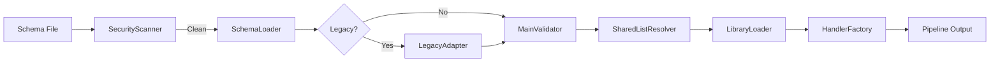

# FlowMCP v2

v2 implements the FlowMCP Specification 2.0.0 with factory-injected handlers, security scanning, shared lists, and library allowlists.

## Import

```javascript
import { FlowMCP } from 'flowmcp-core/v2'
```

## Architecture



## Pipeline

The Pipeline orchestrates the full schema loading process:

1. **SecurityScanner** - Static scan for forbidden patterns (import, eval, process, etc.)
2. **SchemaLoader** - Dynamic import, extracts `main` and `handlers` exports
3. **LegacyAdapter** - Detects and converts v1.2.x schemas automatically
4. **MainValidator** - Validates the `main` block (namespace, version, routes, parameters)
5. **SharedListResolver** - Loads shared lists, applies filters, deep-freezes
6. **LibraryLoader** - Checks allowlist, dynamically imports approved libraries
7. **HandlerFactory** - Calls factory function, validates handler keys against routes

## Public Methods

### `FlowMCP.loadSchema( { filePath, listsDir, allowlist } )`

Full pipeline: scan, load, validate, resolve lists, load libraries, create handlers.

Returns `{ status, messages, main, handlerMap, sharedLists, libraries, warnings }`.

### `FlowMCP.scanSecurity( { filePath } )`

Static security scan only.

Returns `{ status, messages }`.

### `FlowMCP.validateMain( { main } )`

Validate a main block structure.

Returns `{ status, messages }`.

### `FlowMCP.fetch( { main, handlerMap, userParams, serverParams, routeName } )`

Execute a request with v2 handler support. Supports three handler phases:

- **`preRequest`** — Modify URL, headers, body before the HTTP request
- **`executeRequest`** — Replace the standard HTTP fetch entirely (e.g. for RPC calls, smart contract interactions)
- **`postRequest`** — Transform the response after fetch or executeRequest

When `executeRequest` is present, the standard HTTP fetch is skipped. The handler receives `{ struct, payload }` where payload includes `userParams`, `serverParams`, and the built URL/headers.

Returns `{ status, messages, data, dataAsString }`.

### `FlowMCP.resolveSharedLists( { sharedListRefs, listsDir } )`

Load and filter shared lists.

Returns `{ sharedLists }`.

### `FlowMCP.loadLibraries( { requiredLibraries, allowlist } )`

Load approved libraries.

Returns `{ libraries }`.

### `FlowMCP.createHandlers( { handlersFn, sharedLists, libraries, routeNames } )`

Create handler map from factory function.

Returns `{ handlerMap }`.

### `FlowMCP.detectLegacy( { module } )`

Detect if a loaded module uses v1.x format.

Returns `{ isLegacy, format }`.

### `FlowMCP.adaptLegacy( { legacySchema } )`

Convert a v1.x schema to v2 format.

Returns `{ main, handlersFn, hasHandlers, warnings }`.

### `FlowMCP.getDefaultAllowlist()`

Returns the default library allowlist.

Returns `{ allowlist }`.

## Two-Export Schema Format

```javascript
// Static, JSON-serializable
export const main = {
    namespace: 'myapi',
    name: 'MyApi',
    description: 'My API integration.',
    version: '2.0.0',
    root: 'https://api.example.com',
    routes: {
        getUser: {
            method: 'GET',
            path: '/users/{{userId}}',
            description: 'Get user by ID.',
            parameters: [
                {
                    position: { key: 'userId', value: '{{USER_PARAM}}', location: 'insert' },
                    z: { primitive: 'string()', options: [ 'min(1)' ] }
                }
            ]
        }
    }
}

// Factory function, receives injected dependencies
export const handlers = ( { sharedLists, libraries } ) => ( {
    getUser: {
        postRequest: async ( { response, struct, payload } ) => {
            return { response: { ...response, processed: true } }
        }
    }
} )
```

## Handler Phases

Handlers support three phases per route:

```javascript
export const handlers = ( { sharedLists, libraries } ) => ( {
    routeName: {
        // Phase 1: Modify request before fetch
        preRequest: async ( { struct, payload } ) => {
            // struct = { url, method, headers, body }
            return { struct, payload }
        },

        // Phase 2: Replace standard HTTP fetch entirely (optional)
        // When present, the standard fetch is SKIPPED
        executeRequest: async ( { struct, payload } ) => {
            // payload includes: url, method, headers, body, userParams, serverParams
            // Use for: RPC calls, smart contract interactions, custom protocols
            const data = await customCall( payload['url'] )
            return { response: data }
            // OR modify struct directly:
            // struct['data'] = data
            // return { struct }
        },

        // Phase 3: Transform response after fetch or executeRequest
        postRequest: async ( { response, struct, payload } ) => {
            return { response: { ...response, enriched: true } }
        }
    }
} )
```

## Security

The SecurityScanner rejects schemas containing any of these patterns:

| Code | Pattern | Reason |
|------|---------|--------|
| SEC001 | `import ` | Zero-import policy |
| SEC002 | `require(` | No CommonJS |
| SEC003 | `eval(` | Code injection |
| SEC004 | `Function(` | Code injection |
| SEC005 | `new Function` | Code injection |
| SEC006 | `process.` | Process access |
| SEC007 | `child_process` | Shell execution |
| SEC008 | `fs.` | Filesystem access |
| SEC009 | `node:fs` | Filesystem access |
| SEC010 | `fs/promises` | Filesystem access |
| SEC011 | `globalThis.` | Global scope |
| SEC012 | `global.` | Global scope |
| SEC013 | `__dirname` | Path leaking |
| SEC014 | `__filename` | Path leaking |
| SEC015 | `setTimeout` | Async side effects |
| SEC016 | `setInterval` | Async side effects |
